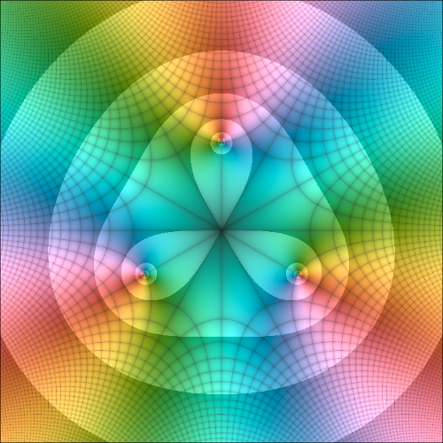

  
  <h1>DomainColoring.jl</h1>

  
  
  

A collection of various ways to plot complex functions for research,
teaching, and fun, supporting both [Plots.jl](https://docs.juliaplots.org)
and [Makie](https://makie.org).
