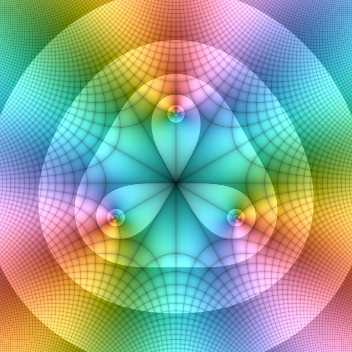

# DomainColoring.jl: Smooth Complex Plotting

Welcome to the documentation of `DomainColoring.jl`, a collection of various
ways to plot complex functions for research, teaching, and fun, supporting
both [Plots.jl](https://docs.juliaplots.org) and [Makie](https://makie.org).

```@raw html
<div align="center">
  
</div>
```

In addition to the static plots provided here, interactive versions using
`GLMakie`, and various 3D visualizations, are available as part of the 
[`ComplexToys.jl` package](https://eprovst.github.io/ComplexToys.jl/).

Domain coloring was first proposed by Farris[^1] and later popularized by the
wonderful book by Wegert[^2]. The plots in this package are mostly inspired by
the designs in the latter, yet using a smooth curve through Oklab space,
yielding a more perceptually uniform representation of the phase (see [The
Arenberg Phase Wheel](@ref)).

[^1]:
    Farris, F. A. (1998), review of T. Needham (1997), _Visual Complex Analysis_
    (Oxford), in _The American Mathematical Monthly_, 105/6: 570–76.
[^2]:
    Wegert, E. (2012), _Visual Complex Functions: An Introduction with Phase
    Portraits_ (Basel).

